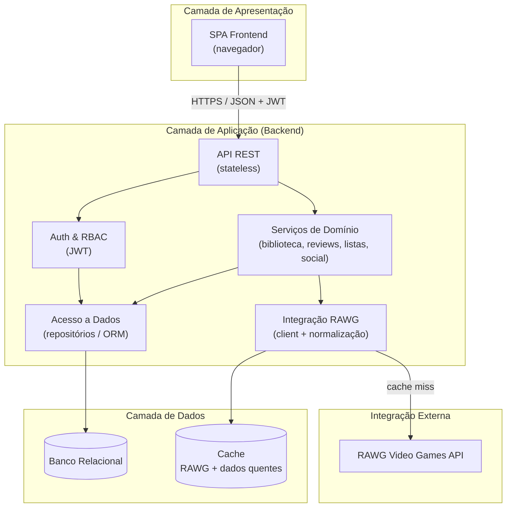

# Item 3 — Diagrama de Arquitetura (Camadas)

## Prompt

```
Você é um arquiteto de software trabalhando na Phase C/D (Information Systems & Technology Architecture) do TOGAF ADM.

Contexto:
- Domínio: app web de descoberta e tracking de video games (estilo Letterboxd para jogos).
- Catálogo vem da RAWG Video Games Database API (integração externa read-only, com chave de API).
- Dados do usuário (biblioteca, reviews, listas, follows, wishlist) ficam em backend próprio com banco relacional.
- Features core e papéis (RBAC) já definidos nos itens 1 e 2.
- Estilo arquitetural desejado: aplicação web em camadas (3-tier), API REST stateless com autenticação via JWT, cache para reduzir chamadas à RAWG.

Tarefa:
Produza o diagrama de arquitetura em camadas do sistema, cobrindo no mínimo: frontend, backend e banco de dados, além de integrações externas e componentes de apoio (cache, autenticação).
1. Descreva textualmente cada camada e seus principais componentes/responsabilidades.
2. Gere um diagrama em Mermaid (graph TD ou flowchart) mostrando o fluxo entre as camadas, incluindo:
   - Camada de apresentação (SPA frontend).
   - Camada de aplicação/backend (API REST, serviços de domínio, camada de integração RAWG, autenticação/autorização).
   - Camada de dados (banco relacional + cache).
   - Integração externa (RAWG API).
3. Indique onde entram cache, autenticação (JWT) e a fronteira do que é proxy/sync da RAWG vs. dado proprietário.

Restrições:
- Não inventar integrações externas além da RAWG API.
- Manter separação clara de responsabilidades entre camadas (frontend não acessa banco diretamente).
- Backend é a única camada que fala com a RAWG e com o banco.

Formato de saída:
- Seção "Camadas": lista Markdown descrevendo cada camada e componentes.
- Seção "Diagrama": bloco de código Mermaid válido.
- Seção "Decisões de arquitetura": 3 a 5 bullets justificando escolhas (cache, statelessness, separação de camadas).
```

## Output (rascunho, validar e refinar com a ferramenta)

### Camadas

- **Apresentação (Frontend)**: SPA responsiva que renderiza catálogo, biblioteca, perfis e feeds; consome a API REST via HTTPS e guarda o token JWT; nunca acessa banco nem a RAWG diretamente.
- **Aplicação (Backend)**: API REST stateless que concentra a lógica de negócio. Subcomponentes: controllers/rotas REST, serviços de domínio (biblioteca, reviews, listas, social), módulo de autenticação/autorização (JWT + RBAC), camada de integração RAWG (client + normalização) e camada de acesso a dados (repositórios/ORM).
- **Dados (Banco relacional)**: persiste usuários, papéis, biblioteca, reviews, listas, follows e wishlist. Fonte de verdade para todo dado proprietário do usuário.
- **Cache**: armazena respostas da RAWG (jogos, detalhes, screenshots) e dados quentes para reduzir latência e número de chamadas à API externa.
- **Integração externa (RAWG API)**: catálogo de jogos read-only; acessada exclusivamente pelo backend, com chave de API e respeito a rate limits.

### Diagrama



### Decisões de arquitetura

- **API stateless com JWT**: permite escalar horizontalmente o backend sem sessão compartilhada; autorização resolvida por papel (RBAC) a cada requisição.
- **Cache de RAWG**: catálogo muda pouco; cachear detalhes e buscas reduz latência, custo e risco de estourar rate limit da API externa.
- **Separação de camadas estrita**: frontend só fala com a API; somente o backend acessa banco e RAWG, garantindo segurança da chave de API e centralização de regras.
- **Fronteira proxy vs. proprietário**: dado de catálogo é read-only/efêmero (cache), dado de usuário é fonte de verdade no banco relacional, evitando duplicação do catálogo inteiro.
- **Banco relacional**: relacionamentos fortes entre usuário, biblioteca, reviews e listas favorecem integridade referencial e consultas agregadas para estatísticas.

## Critérios de aceite

- [ ] As 3 camadas obrigatórias (frontend, backend, banco) presentes e descritas
- [ ] Diagrama Mermaid válido e renderizável
- [ ] Cache, autenticação (JWT) e integração RAWG posicionados corretamente
- [ ] Frontend não acessa banco nem RAWG diretamente
- [ ] Backend é o único ponto de contato com banco e RAWG
- [ ] 3 a 5 decisões de arquitetura justificadas

---

> **Ferramenta utilizada:** Claude (Anthropic), modelo Opus 4.8 — texto e código Mermaid gerados no mesmo chat.
