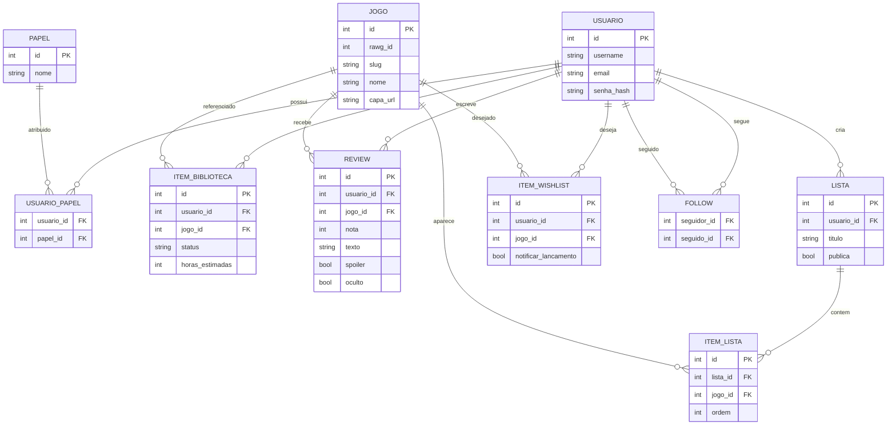

# Item 4 — Entidades Principais e Relacionamentos

## Prompt

> Você é um arquiteto de software / modelador de dados trabalhando na Phase C (Data Architecture) do TOGAF ADM.  
>
> Contexto:  
> - Domínio: app web de descoberta e tracking de video games (estilo Letterboxd para jogos).  
> - Catálogo vem da RAWG API (read-only, cacheado); dados do usuário ficam em banco relacional próprio.  
> - Features core (itens 1-3): biblioteca pessoal com status, reviews com nota, listas customizadas, follow social, wishlist com alertas, perfil com estatísticas.  
> - Papéis RBAC (item 2): Visitante, Usuário registrado, Moderador, Administrador.  
>
> Decisão de modelagem importante:  
> O catálogo da RAWG NÃO é replicado por completo no banco. Para cada jogo referenciado pelo usuário (na biblioteca, review, lista ou wishlist), guardamos apenas um registro "Jogo" mínimo (rawg_id + nome + slug + capa cacheados), que funciona como referência local ao catálogo externo. Os detalhes ricos vêm da RAWG sob demanda.  
>
> Tarefa:  
> Defina as entidades principais do banco relacional e seus relacionamentos.  
> 1. Liste cada entidade com seus atributos principais (incluindo PK, FKs e campos relevantes). Não precisa listar todos os campos de auditoria, mas inclua os que importam para regra de negócio.  
> 2. Indique a cardinalidade de cada relacionamento (1:1, 1:N, N:N) e quais precisam de tabela associativa.  
> 3. Gere um diagrama ER em Mermaid (erDiagram) com as entidades e relacionamentos.  
>
> Entidades esperadas (no mínimo): Usuario, Papel/Role, Jogo (referência ao catálogo RAWG), ItemBiblioteca (com status), Review, Lista, ItemLista, Follow, ItemWishlist.  
>
> Restrições:  
> - Banco relacional, integridade referencial via FKs.  
> - "Jogo" é referência ao catálogo externo, não cópia completa.  
> - Relacionamentos N:N (ex: Lista x Jogo, Usuario x Usuario follow) modelados com tabela associativa.  
> - Status de biblioteca como enum/valor controlado (jogando, zerado, quero jogar, dropei, platinado).  
>
> Formato de saída:  
> - Seção "Entidades": para cada entidade, nome + lista de atributos com tipo e marcação de PK/FK.  
> - Seção "Relacionamentos": lista com cardinalidades.  
> - Seção "Diagrama ER": bloco Mermaid erDiagram válido.  

## Output (rascunho, validar e refinar com a ferramenta)

### Entidades

- **Usuario**: `id` (PK), `username`, `email`, `senha_hash`, `bio`, `avatar_url`, `criado_em`.
- **Papel (Role)**: `id` (PK), `nome` (visitante, usuario, moderador, admin). Relacionado a Usuario via tabela associativa `UsuarioPapel`.
- **UsuarioPapel**: `usuario_id` (FK), `papel_id` (FK) — PK composta.
- **Jogo** (referência ao catálogo RAWG): `id` (PK), `rawg_id` (único), `slug`, `nome`, `capa_url`, `sincronizado_em`.
- **ItemBiblioteca**: `id` (PK), `usuario_id` (FK), `jogo_id` (FK), `status` (enum: jogando|zerado|quero_jogar|dropei|platinado), `horas_estimadas`, `iniciado_em`, `finalizado_em`.
- **Review**: `id` (PK), `usuario_id` (FK), `jogo_id` (FK), `nota` (0-10), `texto`, `spoiler` (bool), `oculto` (bool, soft-delete por moderador), `criado_em`.
- **Lista**: `id` (PK), `usuario_id` (FK), `titulo`, `descricao`, `publica` (bool), `criado_em`.
- **ItemLista**: `id` (PK), `lista_id` (FK), `jogo_id` (FK), `ordem`, `nota_curadoria`.
- **Follow**: `seguidor_id` (FK Usuario), `seguido_id` (FK Usuario), `criado_em` — PK composta.
- **ItemWishlist**: `id` (PK), `usuario_id` (FK), `jogo_id` (FK), `notificar_lancamento` (bool), `criado_em`.

### Relacionamentos

| # | Relacionamento | Cardinalidade | Observação |
|---|----------------|---------------|------------|
| 1 | Usuario ↔ Papel | N:N | via `UsuarioPapel` |
| 2 | Usuario → ItemBiblioteca | 1:N | um usuário tem vários itens |
| 3 | Jogo → ItemBiblioteca | 1:N | um jogo aparece em várias bibliotecas |
| 4 | Usuario → Review | 1:N | um usuário escreve várias reviews |
| 5 | Jogo → Review | 1:N | um jogo recebe várias reviews |
| 6 | Usuario → Lista | 1:N | um usuário cria várias listas |
| 7 | Lista ↔ Jogo | N:N | via `ItemLista` |
| 8 | Usuario ↔ Usuario (follow) | N:N | via `Follow` (auto-relacionamento) |
| 9 | Usuario → ItemWishlist | 1:N | wishlist do usuário |
| 10 | Jogo → ItemWishlist | 1:N | jogo desejado por vários usuários |

> Restrições de unicidade sugeridas: `ItemBiblioteca(usuario_id, jogo_id)` único; `Review(usuario_id, jogo_id)` único (uma review por jogo por usuário); `ItemWishlist(usuario_id, jogo_id)` único.

### Diagrama ER

## Critérios de aceite

- [ ] Todas as entidades mínimas presentes (Usuario, Papel, Jogo, ItemBiblioteca, Review, Lista, ItemLista, Follow, ItemWishlist)
- [ ] Jogo modelado como referência ao catálogo RAWG, não cópia completa
- [ ] Relacionamentos N:N com tabela associativa (Lista×Jogo, Usuario×Usuario, Usuario×Papel)
- [ ] Cardinalidades explícitas para cada relacionamento
- [ ] Restrições de unicidade definidas onde a regra de negócio exige
- [ ] Diagrama ER em Mermaid válido e renderizável

---

> **Ferramenta utilizada:** Claude (Anthropic), modelo Opus 4.8 — texto e diagrama ER em Mermaid gerados no mesmo chat.
