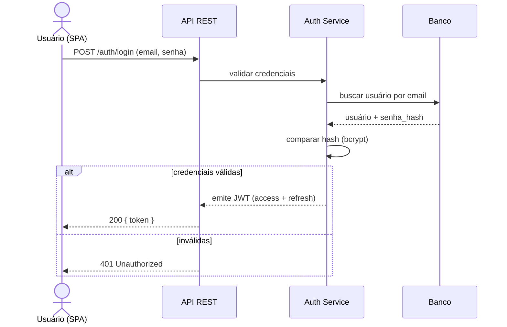
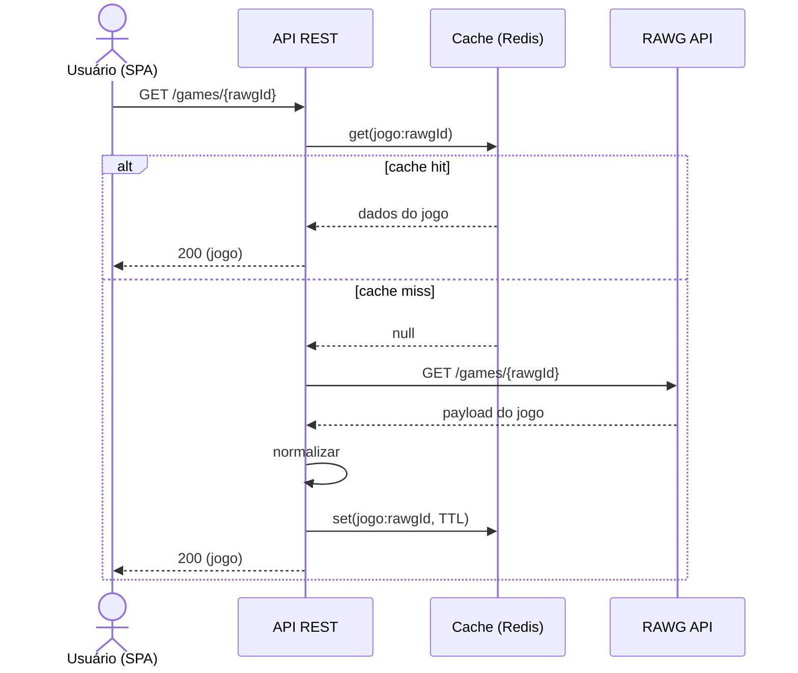
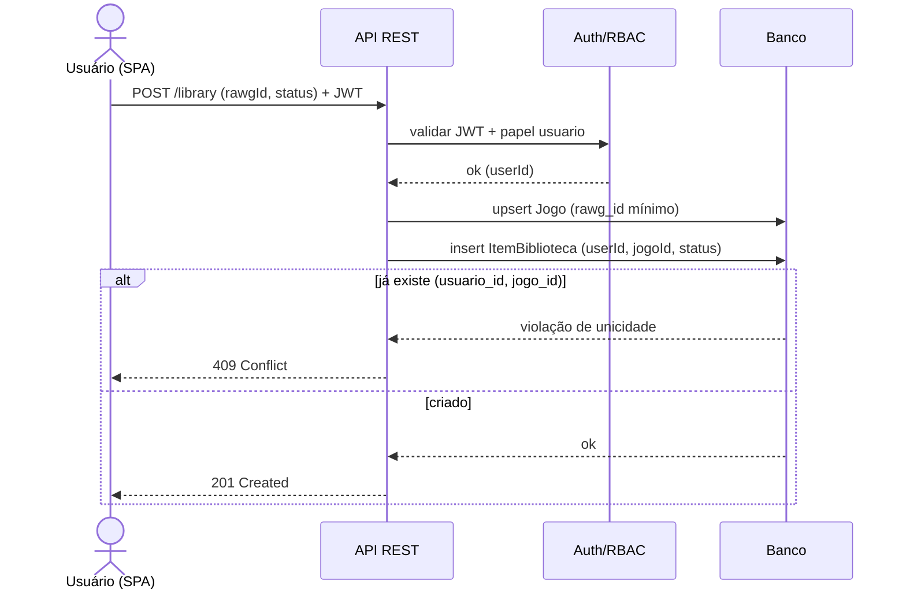
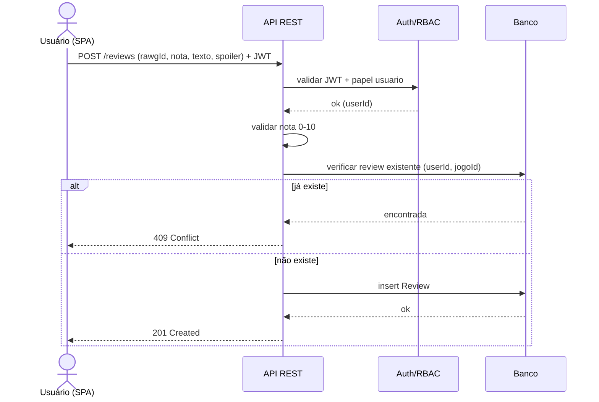
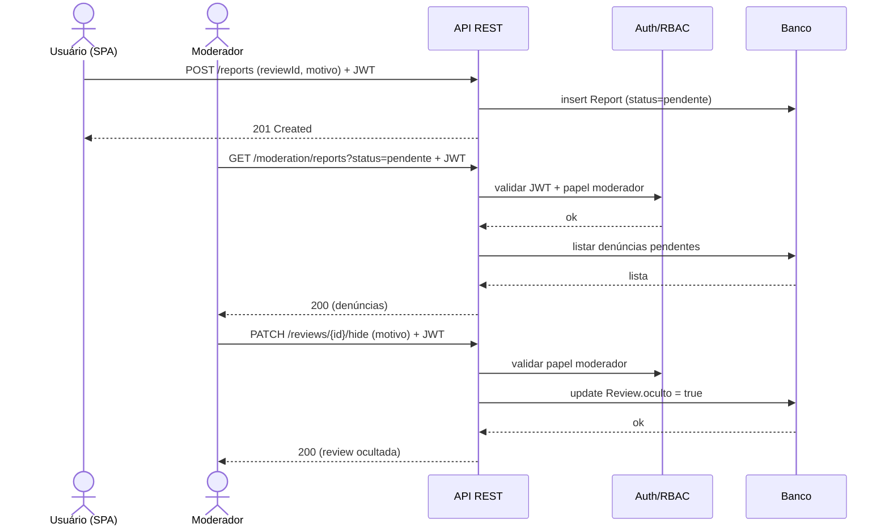

# Item 7 — Fluxos Principais

## Prompt

> Você é um arquiteto de software trabalhando na Phase B/C do TOGAF ADM, detalhando fluxos de processo do sistema.  
>
> Contexto:  
> - Domínio: app web de descoberta e tracking de video games (estilo Letterboxd para jogos).  
> - Arquitetura (itens 3-6): SPA frontend, API REST stateless (JWT + RBAC), banco relacional, cache Redis, integração read-only com a RAWG API (cache-aside).  
> - Entidades e endpoints já definidos (itens 4-5).  
>
> Tarefa:  
> Descreva os fluxos principais do sistema, combinando descrição textual e diagramas de sequência em Mermaid.  
> Cubra no mínimo os fluxos:  
> 1. Autenticação (login retornando JWT).  
> 2. Busca/visualização de jogo com cache-aside da RAWG (cache hit e cache miss).  
> 3. Adicionar jogo à biblioteca com status (escrita autenticada + ownership).  
> 4. Criar review (com validação de papel e regra "uma review por jogo por usuário").  
> 5. Moderação de conteúdo reportado (denúncia → fila → soft-delete por moderador).  
>
> Para cada fluxo:  
> - Escreva um parágrafo curto descrevendo o passo a passo e as regras de negócio envolvidas.  
> - Gere um diagrama Mermaid (sequenceDiagram) com os atores/participantes corretos (Usuário/SPA, API, Auth, Cache, Banco, RAWG).  
>
> Restrições:  
> - Refletir a separação de camadas: SPA fala só com a API; só o backend acessa banco, cache e RAWG.  
> - Mostrar onde JWT é validado e onde ownership/papel é checado.  
> - No fluxo de catálogo, mostrar explicitamente cache hit vs. cache miss.  
>
> Formato de saída:  
> - Para cada fluxo: subtítulo, parágrafo descritivo e bloco Mermaid sequenceDiagram válido.  

## Output (rascunho, validar e refinar com a ferramenta)

### Fluxo 1 — Autenticação (login)

O usuário envia credenciais para a API, que valida o hash da senha no banco e, em caso de sucesso, emite um JWT (access + refresh). O token passa a acompanhar toda requisição autenticada subsequente. Credenciais inválidas retornam 401.

### Fluxo 2 — Buscar/ver jogo (cache-aside RAWG)

A SPA pede detalhes de um jogo à API. O backend consulta primeiro o cache (Redis); em cache hit, responde imediatamente. Em cache miss, chama a RAWG API, normaliza o payload, grava no cache com TTL e então responde. O catálogo é read-only e não toca o banco proprietário.

### Fluxo 3 — Adicionar jogo à biblioteca

Requisição autenticada: a API valida o JWT, garante que o "Jogo" referência (rawg_id) exista localmente (cria registro mínimo se necessário) e insere o ItemBiblioteca vinculado ao usuário do token, com o status escolhido. A constraint única (usuario_id, jogo_id) impede duplicidade.

### Fluxo 4 — Criar review

A API valida o JWT, verifica a regra "uma review por jogo por usuário" e persiste a review com nota (0-10), texto e flag de spoiler. Violação da unicidade retorna 409; nota fora do intervalo retorna 422.

### Fluxo 5 — Moderação de conteúdo reportado

Um usuário denuncia uma review; a denúncia entra na fila de moderação. Um Moderador lista as denúncias pendentes e decide ocultar (soft-delete) a review, registrando o motivo. O conteúdo não é apagado fisicamente, apenas marcado como `oculto`, deixando de aparecer publicamente.

## Critérios de aceite

- [ ] Os 5 fluxos mínimos cobertos, cada um com descrição textual + diagrama Mermaid
- [ ] Cache hit vs. cache miss explícito no fluxo de catálogo
- [ ] Validação de JWT e checagem de papel/ownership visíveis nos fluxos de escrita
- [ ] Regras de negócio (unicidade biblioteca/review, soft-delete) refletidas
- [ ] Separação de camadas respeitada (SPA → API → cache/banco/RAWG)
- [ ] Diagramas sequenceDiagram em Mermaid válidos e renderizáveis

---

> **Ferramenta utilizada:** Claude (Anthropic), modelo Opus 4.8 — texto e diagramas de sequência em Mermaid gerados no mesmo chat.
